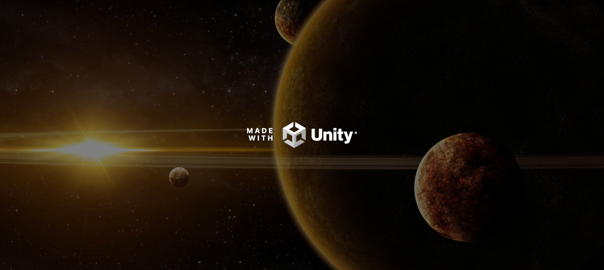
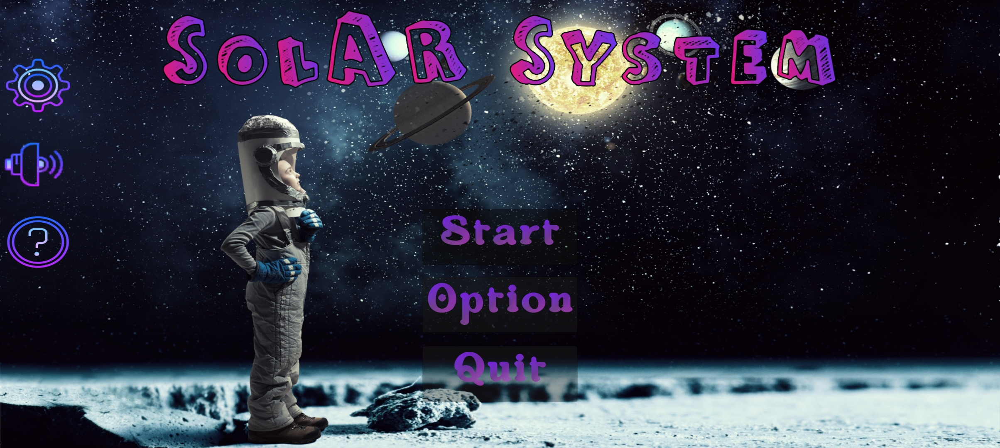

# SolAR-System

SolAR System is an Augmented Reality App, which consists of great user Interface where all the necessary features are added and works really smoothly. This App is a solar sytem App in which you can experienced in an augmented reality way, you can learn about planets and take a closure look at planets and their textures.

This App is build using Unity Game Engine
version : unity 2021.3.16f1
Assets files were not included in github due to some issues.

  

